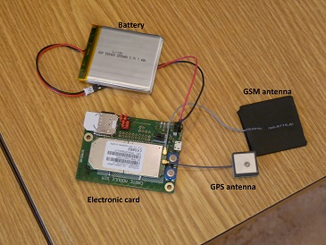
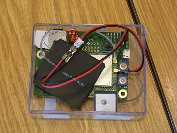

# Tracking devices

This directory contains the details for the tracker hardware used with the
server.

Components:

- SIMCOM 5218 mobile data modem (http://simcom.ee/modules/wcdma-hspa/sim5218/)
- GPS antenna MIA-18 (http://fr.farnell.com/maxtena/mia-gps-18/ant-embedded-gps-active-18mm/dp/2281637)
- GSM antenna ATN-PCB4242 (http://fr.farnell.com/rf-solutions/ant-pcb4242-fl/antenne-pcb-gsm-pentaband-42x42/dp/2133448)
- the board made by Benoit, Quentin & Bastien (and other sorry if I forgot someone)
- LiPo battery 2000 mAh (https://fr.rs-online.com/web/p/blocs-batteries-lithium/7916460/)

- `autorun_ref.lua` is the script which is loaded onto the devices.
